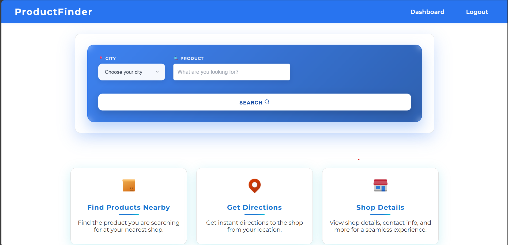
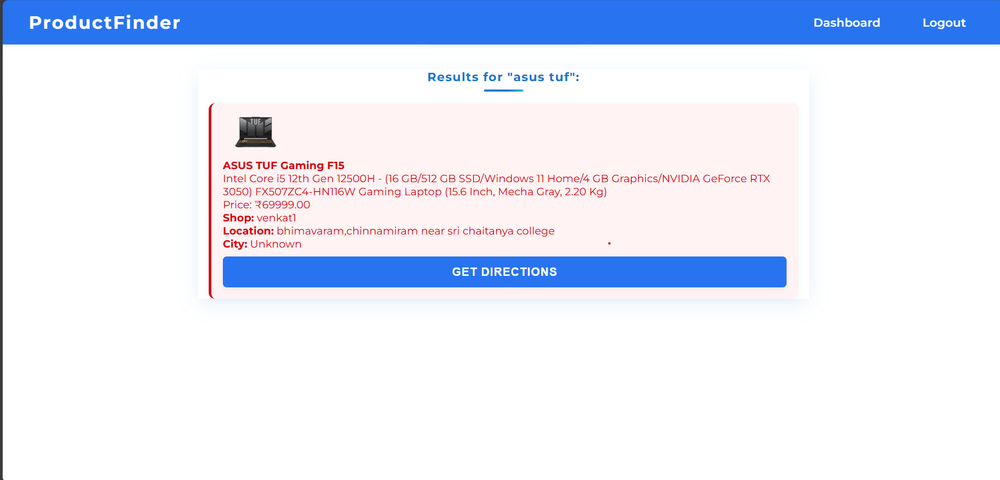
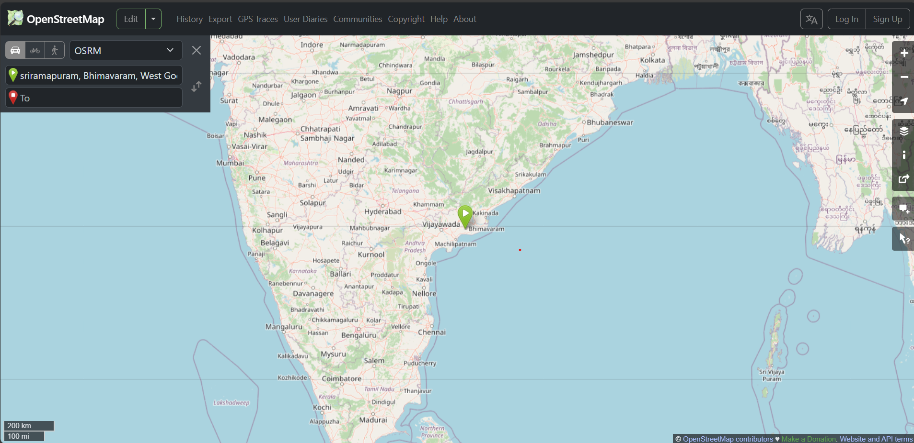

#ProductFinder 

ProductFinder is a location-based product discovery app that helps users find products in nearby shops and get directions. Merchants can register their shop, add products (with images), and manage listings.

## Tech Stack
- Django 5.2
- SQLite (dev)
- HTML/CSS/JavaScript
- Leaflet.js + OpenStreetMap (tiles/routing links)

## Features
- User authentication (merchant vs user)
- Shop registration with latitude/longitude and city
- Product CRUD for merchants (image uploads)
- User search with optional city filter and directions link

## Local Setup

1) Create and activate a virtual environment
```bash
python -m venv venv
# Windows PowerShell
venv\Scripts\Activate.ps1
```

2) Install dependencies
```bash
pip install -r requirements.txt
```

3) Run migrations
```bash
python manage.py migrate
```

4) Start the dev server
```bash
python manage.py runserver
```
App will be available at http://127.0.0.1:8000/

## Media & Static
- Uploaded images are stored under `media/product_images/`
- Static files in `static/`; collected assets in `staticfiles/` (ignored by git)

## Notes
- This project uses OpenStreetMap tiles in the browser (no API key required) and opens OSM routing links for directions.
- Admin can be enabled by creating a superuser: `python manage.py createsuperuser`.







